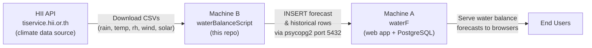
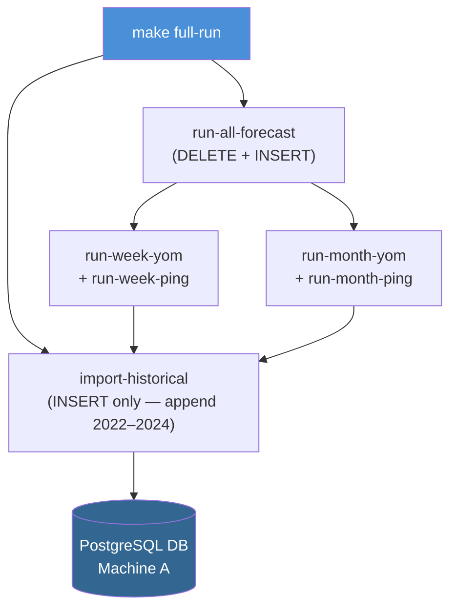
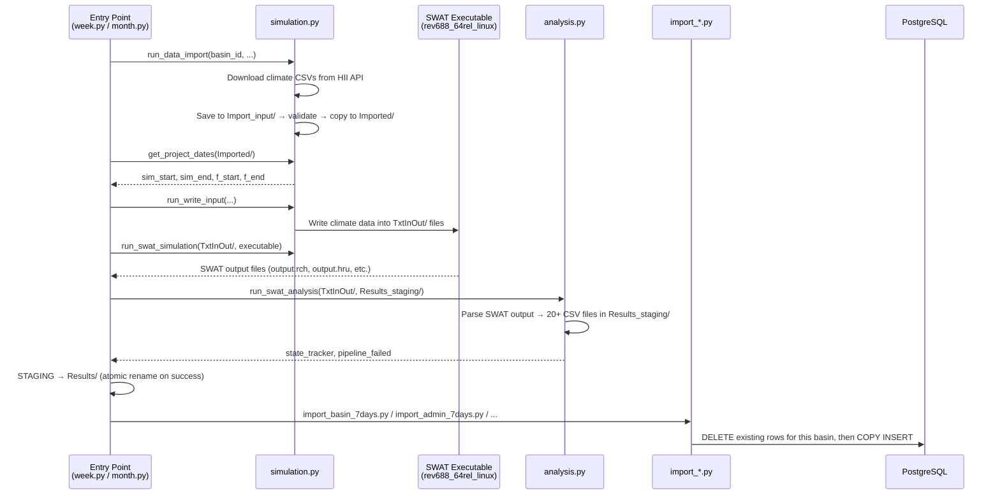
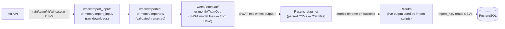

# waterBalanceScript

SWAT water balance simulation pipeline for Thailand river basins. Runs hydrological forecasts for the **Yom** and **Ping** basins, then imports results into the PostgreSQL database that powers the [waterF](https://github.com/robotayyyyy/waterF) web application.

---

## System Architecture

Two separate machines collaborate:



- **Machine A** — runs `waterF` (Next.js + NestJS + PostgreSQL via Docker). Must be running and reachable on port 5432.
- **Machine B** — runs this repo. Fetches climate data, executes SWAT simulation, analyses output, imports results into Machine A's DB.

---

## High-Level Pipeline

There are two pipelines that run together via `make full-run`:



| Pipeline | Strategy | When | What it populates |
|---|---|---|---|
| **Forecast** | `DELETE` basin rows then `INSERT` fresh | Each run | 7-day and 6-month forecast tables |
| **Historical** | `INSERT` only (append, no delete) | Each run, after forecast | Same tables — fills in 2022–2024 baseline |

> **Order matters:** Forecast runs first (wiping and refilling forecast rows), historical appends on top. Reversing this order would delete the historical baseline.

---

## Forecast Pipeline — Low Level

One full forecast pipeline execution for a single basin and mode (`week` or `month`):



### Key files per basin

```
swat_forecast/{yom,ping}/
├── config.py          # All path constants (BASE_DIR, TxtInOut, Results, etc.)
├── week.py            # Entry point — weekly forecast (SWAT_MODE=week)
├── month.py           # Entry point — monthly forecast (SWAT_MODE=month)
├── simulation.py      # Data download from HII API + SWAT exe runner
├── analysis.py        # Parse SWAT output files → Results_staging/ CSVs
├── _db.py             # DB connection (reads root .env)
├── import_basin_7days.py    # Weekly basin-level DB import
├── import_basin_6months.py  # Monthly basin-level DB import
├── import_admin_7days.py    # Weekly admin (province/amphoe/tambon) DB import
├── import_admin_6months.py  # Monthly admin DB import
├── import_basin_daily.py    # Daily breakdown import (both modes)
├── import_admin_daily.py    # Daily admin breakdown import (both modes)
└── Inputs/            # Static reference data (thresholds, fractions, reservoir mapping)
```

```
swat_forecast/
├── utils.py           # Shared: logger, send_email_alert, generate_email_alert, helpers
└── swat_rev688/       # SWAT Fortran executable (unpacked from Drive zip, gitignored)
```

---

## Data Flow — Files and Directories



### Results/ CSV → DB table mapping

| CSV file | DB table(s) |
|---|---|
| `Bonwr_Weekly.csv` | `basin_watershed_7days` |
| `Sbonwr_Weekly.csv` | `basin_subbasin_l1_7days` |
| `Analysis_Sbswat_Weekly.csv` | `basin_subbasin_l2_7days` |
| `Bonwr_Monthly.csv` | `basin_watershed_6months` |
| `Sbonwr_Monthly.csv` | `basin_subbasin_l1_6months` |
| `Analysis_Sbswat_Monthly.csv` | `basin_subbasin_l2_6months` |
| `Province_Daily.csv` / `Amphoe_Daily.csv` / `Tambol_Daily.csv` | `forecast_province_daily_*` / `forecast_amphoe_daily_*` / `forecast_tambon_daily_*` |
| *(+weekly/monthly variants for all admin levels)* | 24 tables total |

---

## Database Tables (24 total)

| Group | Tables |
|---|---|
| Weekly aggregated | `basin_watershed_7days`, `basin_subbasin_l1_7days`, `basin_subbasin_l2_7days`, `forecast_province_7days`, `forecast_amphoe_7days`, `forecast_tambon_7days` |
| Monthly aggregated | `basin_watershed_6months`, `basin_subbasin_l1_6months`, `basin_subbasin_l2_6months`, `forecast_province_6months`, `forecast_amphoe_6months`, `forecast_tambon_6months` |
| Daily (weekly window) | `basin_watershed_daily_7days`, `basin_subbasin_l1_daily_7days`, `basin_subbasin_l2_daily_7days`, `forecast_province_daily_7days`, `forecast_amphoe_daily_7days`, `forecast_tambon_daily_7days` |
| Daily (monthly window) | `basin_watershed_daily_6months`, `basin_subbasin_l1_daily_6months`, `basin_subbasin_l2_daily_6months`, `forecast_province_daily_6months`, `forecast_amphoe_daily_6months`, `forecast_tambon_daily_6months` |

Schema is defined in `waterF/init-scripts/`. Run `make hard-reset` in the waterF repo to recreate all tables.

---

## Basin Reference

| Basin | `mb_code` | Total subbasins | SWAT mode |
|---|---|---|---|
| Yom | `08` | 673 | week + month |
| Ping | `06` | 612 | week + month |

---

## Large Files — Google Drive

Files too large for git are stored on Google Drive and downloaded by `make download-drive`:

| Zip file | Contents | Unpacked to |
|---|---|---|
| `yom_week_TxtInOut.zip` | Yom weekly SWAT model inputs | `swat_forecast/yom/week/TxtInOut/` |
| `yom_month_TxtInOut.zip` | Yom monthly SWAT model inputs | `swat_forecast/yom/month/TxtInOut/` |
| `ping_week_TxtInOut.zip` | Ping weekly SWAT model inputs | `swat_forecast/ping/week/TxtInOut/` |
| `ping_month_TxtInOut.zip` | Ping monthly SWAT model inputs | `swat_forecast/ping/month/TxtInOut/` |
| `swat_rev688.zip` | SWAT Fortran executable | `swat_forecast/swat_rev688/` |
| `ping_historical.zip` | Historical CSVs 2022–2024 (Ping) | `historical_data/ping/` |
| `yom_historical.zip` | Historical CSVs 2022–2024 (Yom) | `historical_data/yom/` |

Drive folder: `https://drive.google.com/drive/folders/1fCaorGy1KrrjTyVYX00a8CO88SsqChTm`

---

## First-Time Setup

### Prerequisites

- Python 3.8+
- `unzip`, `gdown` (installed by `setup.sh`)
- Machine A (waterF PostgreSQL) running and reachable

### Steps

```bash
# 1. Clone
git clone https://github.com/robotayyyyy/waterBalanceScript
cd waterBalanceScript

# 2. Create .env (never committed — gitignored)
cp .env.example .env
nano .env   # fill in DATABASE_HOST, DATABASE_PASSWORD, SMTP_PASS, ALERT_EMAIL

# 3. Run full setup (creates venvs, downloads from Drive, unpacks all zips)
bash setup.sh

# 4. Verify DB connection
make verify-db
```

### `.env` reference

```env
DATABASE_HOST=<Machine-A-IP>     # or localhost if both on same machine
DATABASE_PORT=5432
DATABASE_USER=postgres
DATABASE_PASSWORD=<password>
DATABASE_NAME=postgres

SMTP_HOST=mailrelay.uc-workd.com
SMTP_PORT=587
SMTP_USER=noreply@hii.or.th
SMTP_PASS=<password>
ALERT_EMAIL=email1@example.com,email2@example.com   # comma-separated

HII_BASE_URL=https://tiservice.hii.or.th/water_balance

# Set to false to skip DB saving (useful for teammates without a local DB)
SWAT_SAVE_DB=true
```

### Allow Machine B to connect to Machine A's PostgreSQL

```bash
# On Machine A — find pg_hba.conf location
docker exec postgres_db psql -U postgres -c "SHOW hba_file;"

# Add Machine B's IP
docker exec postgres_db bash -c "echo 'host all all <MachineB-IP>/32 md5' >> /var/lib/postgresql/data/pg_hba.conf"
docker exec postgres_db psql -U postgres -c "SELECT pg_reload_conf();"

# Verify from Machine B
nc -zv <MachineA-IP> 5432
```

---

## Make Commands Reference

```
make setup              First-time setup: venvs + Drive download + unpack
make check-db           Test DB connection
make full-run           Full pipeline: forecast (DELETE+INSERT) then historical append
make run-all-forecast   Run all 4 SWAT pipelines + DB import (no historical)
make run-week-yom       Weekly Yom SWAT run + import
make run-week-ping      Weekly Ping SWAT run + import
make run-month-yom      Monthly Yom SWAT run + import
make run-month-ping     Monthly Ping SWAT run + import
make import-historical  Append 2022–2024 historical data (no SWAT re-run)
make reimport-forecast  Re-import from existing Results/ (no SWAT re-run)
make reimport-all       Clear DB then reimport forecast + historical (no SWAT re-run)
make verify-db          Show row counts and date ranges per basin
make clear-db           Delete ALL rows from all 24 tables (both basins)
make clear-ping         Delete only Ping rows (mb_code=06)
make clear-yom          Delete only Yom rows (mb_code=08)
make download-drive     Download all 7 zips from Google Drive
make unpack-all         Unpack all zips (TxtInOut + swat_rev688 + historical)
make install-cron       Install all pipeline cron jobs + log rotation
make uninstall-cron     Remove this project's cron jobs (leaves others untouched)
make show-cron          Show current crontab
```

---

## Cron Setup (Recommended)

```bash
make install-cron    # add all 4 pipelines + log cleanup to crontab
make show-cron       # verify what's installed
make uninstall-cron  # remove only this project's entries (other cron jobs are untouched)
```

Runs all four pipelines daily at 01:00–01:10 and cleans logs older than 90 days at 01:15. Re-running `install-cron` is idempotent — it replaces existing entries for this project.

---

## Maintenance Guide

### Update thresholds / static reference data

All static lookup tables live in `swat_forecast/{yom,ping}/Inputs/`:

| File | Purpose |
|---|---|
| `runoff/day\|week\|month/*_critical.csv` | Runoff index thresholds by admin level and time window |
| `WB_level/day\|week\|month/*_wb_level.csv` | Water balance level thresholds |
| `drought_thershold.csv` | Drought index thresholds |
| `fraction.csv` | Subbasin → admin area fraction mapping |
| `SBfraction.csv` | Subbasin → watershed fraction |
| `res_mapping.json` | Reservoir → subbasin mapping |
| `Release/{id}.csv` | Dam release schedules by subbasin ID |
| `Flow/{id}.csv` | Observed flow data by subbasin ID |

Edit the CSV files directly, then re-run `make full-run`.

### Add a new email alert recipient

Edit `.env` on Machine B:
```env
ALERT_EMAIL=existing@example.com,new@example.com
```
No code changes needed. `send_email_alert()` in `swat_forecast/utils.py` splits on commas automatically.

### Re-run import without re-running SWAT

If SWAT output in `Results/` is correct but DB data needs refreshing:
```bash
make reimport-all   # clear DB + reimport forecast + historical (fast — no SWAT run)
```

### Refresh historical data (new CSVs from Drive)

```bash
make download-drive     # re-download Drive zips
make unpack-historical  # unpack ping/yom historical CSVs into historical_data/
make clear-ping         # or clear-yom to wipe only one basin
make import-historical  # re-import
make verify-db          # confirm row counts
```

### SWAT model update (new TxtInOut)

```bash
# Zip the new TxtInOut and upload to the Google Drive folder, then on Machine B:
make download-drive
make unpack-yom   # or unpack-ping
make run-week-yom # test run
```

### Add a new basin

1. Duplicate `swat_forecast/yom/` → `swat_forecast/{new_basin}/`
2. Update `basin_id`, `mb_code`, `mb_name_t`, `total_subbasins` in `week.py` and `month.py`
3. Add flow/release IDs in `config.py → get_pipeline_paths()`
4. Add new `Inputs/` reference files for the basin
5. Add `run-week-{basin}` and `run-month-{basin}` targets to `Makefile`
6. Upload TxtInOut zip and historical zip to Google Drive

### Check what's in the DB

```bash
make verify-db
```

Expected output shows row counts and min/max `date_sim` per table per basin. Zero rows indicates a failed import.

---

## Troubleshooting

| Symptom | Cause | Fix |
|---|---|---|
| `ModuleNotFoundError` | Running `python3` directly instead of via `make` | Always use `make` — it uses the correct venv |
| `Connection refused` on port 5432 | Machine A's DB not running, or Machine B's IP not in pg_hba.conf | Check `docker ps` on Machine A; add IP to pg_hba.conf |
| `NoneType` in DB config | `.env` not found or variable missing | Verify `.env` exists at repo root; check all 5 DB vars are set |
| Download timeout / 404 | HII API unavailable | Check `HII_BASE_URL` in `.env`; retry later |
| SWAT exits non-zero | Bad input data or model error | Check `week/Logs/` for the latest log; look for `SWAT simulation failed` |
| `Results/` empty after run | `Results_staging/` rename didn't complete | Check logs; if staging exists but Results doesn't, manually: `mv Results_staging Results` |
| Email not sent | SMTP credentials wrong or `ALERT_EMAIL` empty | Test SMTP credentials; verify `.env` has `ALERT_EMAIL` set |
| `gdown` auth error | Google Drive requires sign-in | Check folder sharing is set to "Anyone with the link" |
| Historical data missing after fresh setup | `unpack-historical` not run | Run `make unpack-historical` then `make import-historical` |
| Teammate has no DB — import fails | DB not available on their machine | Set `SWAT_SAVE_DB=false` in `.env` to skip DB saving; import steps are marked SKIPPED in the summary email |
| `Permission denied` on `run_state.json` | Previous run used `sudo`, file owned by root | Run `sudo chown -R <user> /path/to/waterBalanceScript/swat_forecast/`; never use `sudo` with `make` |

---

## Repository Structure

```
waterBalanceScript/
├── .env                        # Secrets — gitignored, copy from .env.example
├── .env.example                # Template with all required keys
├── Makefile                    # All pipeline commands
├── setup.sh                    # First-time setup script
├── swat_forecast/
│   ├── utils.py                # Shared: logger, email alert, CSV helpers
│   ├── requirements.txt
│   ├── swat_rev688/            # SWAT executable — gitignored (from Drive)
│   ├── yom/                    # Yom basin (mb_code=08)
│   │   ├── config.py           # Paths and constants
│   │   ├── week.py             # Weekly pipeline entry point
│   │   ├── month.py            # Monthly pipeline entry point
│   │   ├── simulation.py       # Data download + SWAT run
│   │   ├── analysis.py         # SWAT output → CSV parsing
│   │   ├── _db.py              # DB connection
│   │   ├── import_*.py         # DB import scripts (6 files)
│   │   ├── Inputs/             # Static reference CSVs and JSON
│   │   ├── week/               # Runtime dirs — gitignored
│   │   │   ├── TxtInOut/       # SWAT model inputs (from Drive)
│   │   │   ├── Import_input/   # Raw downloaded climate data
│   │   │   ├── Imported/       # Validated climate data
│   │   │   ├── Results/        # Final parsed output CSVs
│   │   │   ├── Results_staging/
│   │   │   ├── Logs/
│   │   │   └── Alerts/
│   │   └── month/              # Same structure as week/
│   └── ping/                   # Ping basin (mb_code=06) — same structure as yom/
├── historical_data/
│   ├── _db.py                  # DB connection
│   ├── import_*.py             # Historical import scripts (6 files)
│   ├── clear_db.py             # Delete all rows
│   ├── clear_basin.py          # Delete rows for one basin
│   ├── verify_db.py            # Row count verification
│   ├── requirements.txt
│   ├── ping/                   # Historical CSVs 2022–2024 — gitignored (from Drive)
│   └── yom/                    # Historical CSVs 2022–2024 — gitignored (from Drive)
└── swat_file_DB/               # Drive zip downloads — gitignored
```
